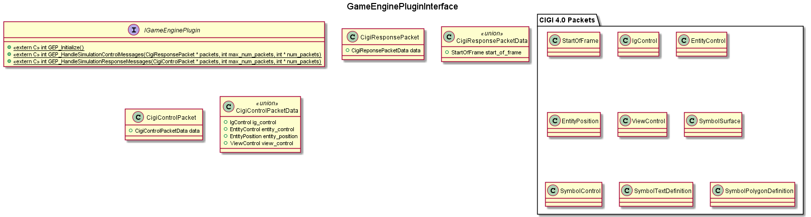
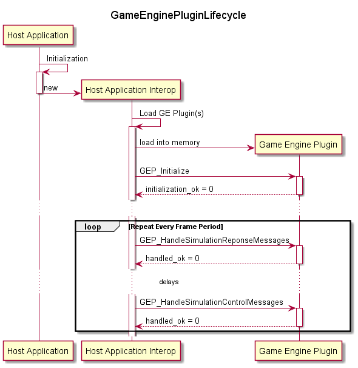
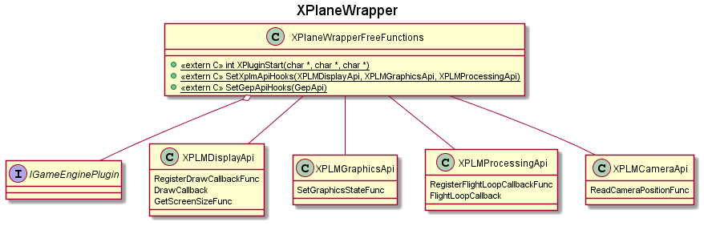

# Simple Game Engine Plugin

The basic premise behind the Simple Game Engine Plugin to allow a developer to compartmentalize logic dealing with 'game objects' so that it may be easily ingested by a wide variety of game engines, image generators (IG), or simulation hosts that provide 3D visuals. The need to support multiple 3D visualization applications over the lifetime of a product is fairly common occurance, particular in the military space. 

Given that these hosts have a wide variety of capabilities through their SDKs that are all different, the intent of this framework to allow *simple* things to be ported between different hosts and leave the specifics to interoperation layers that can be written for the host in question. 

---

## General Concepts

A host application ingests instances of a game engine plugin and interacts with it via the defined IGameEnginePlugin free functions. 

The general lifecycle of game engine plugins is as follows:

 1. The Host Application creates an interoperation layer during its initialization.
    - This initialization is host-specific and would likely consist of loading its own 'wrapper plugins'.
    - The *GameEnginePlugin* project includes interopation examples with *X-Plane 11* and **TBD**. 
 2. The Host Application interoperation layer dynamically loads libraries that implement *GameEnginePlugin* free functions calls their *GEP_Initialize" functions.
 3. **IN PROGRESS:** During normal operation, the Host Application will update its state and convert relevant *Simulation Host* state information to structures passed to *GEP_HandleHostControlMessages* function calls.
 4. **FUTURE:** Add handling of Host Response messages.
 5. **FUTURE:** Add Shutdown operation.

---

## X-Plane Operation

The X-Plane application was chosen as a *GameEnginePlugin* integration example because it has an unlimited free trial, an extensible plugin framework, and commonalities with simulation systems that utilize IGs. 

### X-Plane Integration Overview

XPlane has a plugin system with a set of APIs collectively referred to as 'XPlugin'. These APIs are implemented as an 'X-Plane Wrapper' to provide *GameEnginePlugin*.

Additional APIs are exported as part of the plugin implementation in order to provide isolated component test capability outside of the X-Plane environment. 

### **XPlane Wrapper Details**

#### **Public APIs**

The XPlane Wrapper implements XPlugin APIs as documented by the [X-Plane Developer](https://developer.x-plane.com/article/developing-plugins/) site. 

*SetXplmApiHooks* is an exported free function that takes in structures of pointers to 'alternate' functions for the various XPLM APIs. Calls to these functions are handled by the test host (i.e. Google Test) and checked for correctness.

#### **Initialization**

The XPlane Wrapper Initialization is as follows:
 1. The XPlaneWrapper library is loaded by host (test host or X-Plane itself) via a Windows *LoadLibrary* call.
 2. The *dllmain* function is called and the default state of global variables is set based on the operating context.
 3. If operating in a test host context, functions are called to pass in alternate functions to the XPLM API functions.
 4. The host calls the *XPluginStart* function and callbacks are registered for the XPlane flight loop and rendering of frames.

#### **Execution**

The XPlane Wrapper Execution is as follows:
 1. The XPlaneWrapper library *Draw Callback* is called by host (test host or X-Plane itself) periodically.
 2. The *Draw Callback* function generates a simulation response message and passed it in as an argument in the GEP_HandleSimulationResponseMessages function to plugins.
 3. The XPlaneWrapper library *Flight Loop Callback* is called by host (test host or X-Plane itself) periodically.
 4. The *Flight Loop Callback* function generates a simulation control message (to include basic state information about the aircraft being controlled) and passed it in as an argument in the GEP_HandleSimulationControlMessages function to plugins.

